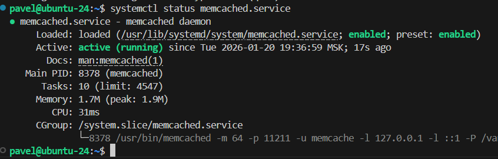
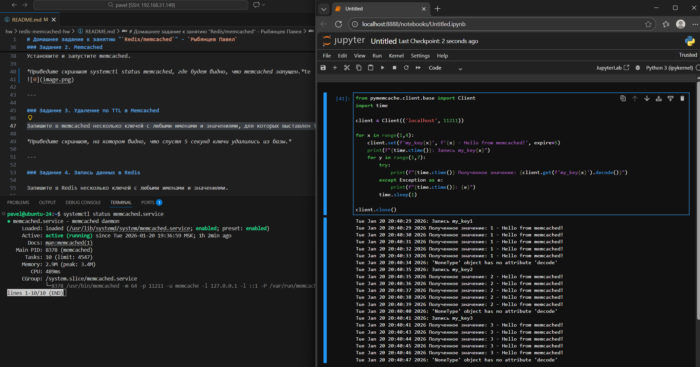
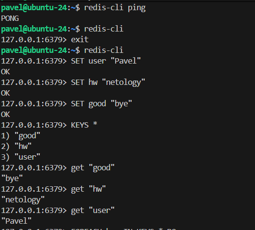
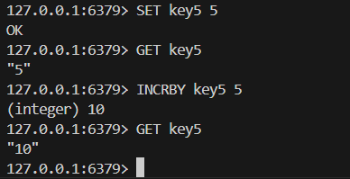

# Домашнее задание к занятию "`Redis/memcached`" - `Рыбянцев Павел`


---

### Задание 1. Кеширование 

Приведите примеры проблем, которые может решить кеширование. 

*Приведите ответ в свободной форме.*
```
1. Повышение скорости отклика
   Когда приложение часто запрашивает одни и те же данные,
   каждое обращение занимает определенное время.
   Кешируя данные в памяти (RAM), мы можем значительно сократить задержку обработки запросов,
   особенно в высоконагруженных системах.

2. Снижение нагрузки на БД
   Частые запросы к основной базе данных увеличивают нагрузку на нее,
   замедляя работу всей системы.
   Использование кеширования позволяет уменьшить количество обращений к БД сервиса, перенаправив повторяющиеся запросы в кэш.

3. Обработка пиковых нагрузок
   Во многих приложениях наблюдаются всплески активности пользователей в определенные моменты (распродажи, праздники). 
   Чтобы выдержать высокие нагрузки без деградации производительности, используются технологии кеширования.

4. Оптимизация сетевых соединений
   Если приложение распределено географически или имеет многоуровневую структуру,
   передача данных между серверами может занимать значительное время. 
   Кеширование промежуточных результатов снижает необходимость частых межсерверных коммуникаций.

```

---

### Задание 2. Memcached

Установите и запустите memcached.

*Приведите скриншот systemctl status memcached, где будет видно, что memcached запущен.*


---

### Задание 3. Удаление по TTL в Memcached

Запишите в memcached несколько ключей с любыми именами и значениями, для которых выставлен TTL 5. 

*Приведите скриншот, на котором видно, что спустя 5 секунд ключи удалились из базы.*
```
Написал небольшой скрипт на python, так как телнетом неудобно и не информативно(время).
```


---

### Задание 4. Запись данных в Redis

Запишите в Redis несколько ключей с любыми именами и значениями. 

*Через redis-cli достаньте все записанные ключи и значения из базы, приведите скриншот этой операции.*


## Дополнительные задания (со звёздочкой*)
Эти задания дополнительные, то есть не обязательные к выполнению, и никак не повлияют на получение вами зачёта по этому домашнему заданию. Вы можете их выполнить, если хотите глубже разобраться в материале.

### Задание 5*. Работа с числами 

Запишите в Redis ключ key5 со значением типа "int" равным числу 5. Увеличьте его на 5, чтобы в итоге в значении лежало число 10.  

*Приведите скриншот, где будут проделаны все операции и будет видно, что значение key5 стало равно 10.*
